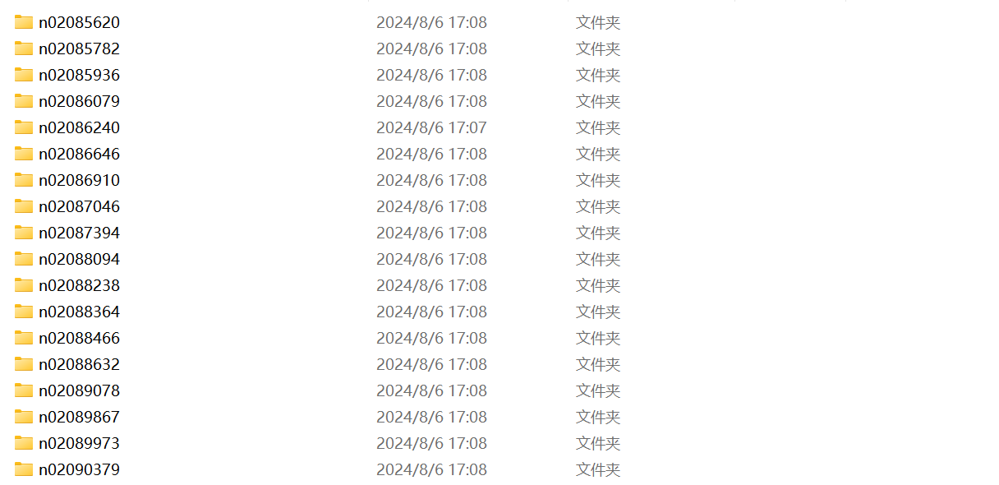
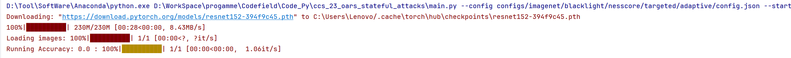
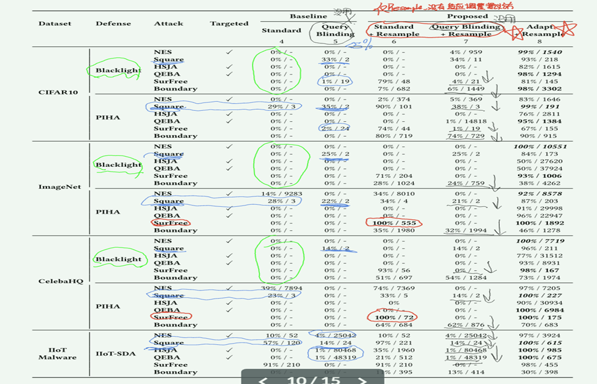
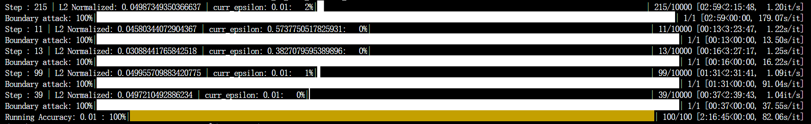
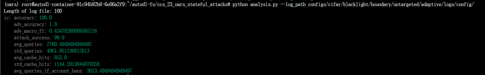

```bash
PYTHONUNBUFFERED=1 PATH=/auto-dl-fs/data/ccs_23_oars_stateful_attacks/attacks:$PATH python main.py --config configs/cifar/blacklight/surfree/untargeted/adaptive/config.json --start_idx 0 --num_images 1
```

```
python main.py --config configs/cifar/blacklight/surfree/untargeted/adaptive/config.json --start_idx 0 --num_images 150
```

```
export PATH=/autodl-fs/data/ccs_23_oars_stateful_attacks/attacks:$PATH
```

```
python main.py --config configs/cifar/blacklight/square/untargeted/standard/config.json --start_idx 0 --num_images 1
```

**准备**：拿到原始图像和标签，确定允许的像素范围。

**找初始样本**：随机生成图像，直到第一个能“骗过”模型为止；若一直找不到，攻击失败。

**边界游走**：不断在当前对抗样本周围

1. “随机”微调，保持“骗过”模型，有时这些尝试会被模型识别出来，因此会被丢弃；
2. 缩回去更贴近原图；
	 如此反复，直到找到更好的样本。

**成功判定**：一旦样本既“骗过”模型，又与原图的差距小于事先设定的阈值，就算攻击成功并返回该样本。

**失败判定**：如果用尽最大尝试次数或步长已缩到极小，仍没找到满足上述双重条件的样本，则攻击失败。


**准备阶段**

1. 接收输入图像 xxx 和标签 yyy，转为 NumPy；
2. 获取模型对 xxx 的预测 ypy_pyp；
3. 确定像素范围 [clip_min,clip_max][\text{clip\_min}, \text{clip\_max}][clip_min,clip_max]。

**初始化对抗样本**

- 尝试最多 `init_size` 次：
	- 随机采样 xrand∈[clip_min,clip_max]x_{\text{rand}}\in[\text{clip\_min},\text{clip\_max}]xrand∈[clip_min,clip_max]；
	- 若 xrandx_{\text{rand}}xrand 对抗成立（非定向：预测≠ypy_pyp，定向：预测＝yyy）且未被拒识，则设为初始 xadvx_{\text{adv}}xadv。
- 若始终未获初始对抗样本，则 **初始化失败，攻击结束**。

**主循环（最多 `max_iter` 次）**

1. **正交扰动**（切线方向）

	- 生成 `num_trial×sample_size` 个扰动候选；
	- 筛出“对抗成立且未拒识”的样本；
	- 计算成功率 δratio\delta_{\mathrm{ratio}}δratio，自适应调整步长 δ\deltaδ。

2. **径向收缩**（朝原图靠近）

	- 对正交阶段的合法样本，再做收缩扰动；
	- 筛出“对抗成立且未拒识”的样本；
	- 计算成功率 ϵratio\epsilon_{\mathrm{ratio}}ϵratio，自适应调整步长 ϵ\epsilonϵ；
	- 在收缩样本中挑选与原图 L₂ 距离最小者，更新 xadvx_{\text{adv}}xadv。

3. **成功判定**

	- 计算归一化 L₂ 距离

		d=∥xadv−x∥2H×W×C  d = \frac{\|x_{\text{adv}} - x\|_2}{\sqrt{H \times W \times C}}d=H×W×C∥xadv−x∥2

	- 若 d<epsd < \text{eps}d<eps 且“对抗成立”，则 **攻击成功，返回 xadvx_{\text{adv}}xadv**；

	- 若步长 ϵ\epsilonϵ 收缩至极小 (<min_epsilon<\text{min\_epsilon}<min_epsilon) 或连续若干迭代无改进，则 **提前终止**。

**失败判定**

- **始终没有**在允许的迭代次数或步长范围内，
- **找到一个同时满足**（1）对抗成功，（2）扰动范数小于阈值 `eps`；
	 最终返回原图或最后的中间结果，即为 **攻击失败**。


## 1.适配RTX4090D的环境依赖

请使用以下环境依赖文件`environment.yaml`

```yaml
name: oars
channels:
  - conda-forge
  - defaults
dependencies:
  - _libgcc_mutex=0.1=main
  - _openmp_mutex=5.1=1_gnu
  - blas=1.0=mkl
  - bzip2=1.0.8=h7b6447c_0
  - ca-certificates=2022.12.7=ha878542_0
  - certifi=2022.12.7=pyhd8ed1ab_0
  - charset-normalizer=2.0.4=pyhd3eb1b0_0
  - conda-pack=0.7.0=pyh6c4a22f_0
  - cudatoolkit=12.1=h7e4eb7f_0  # 更新 CUDA 工具包到 12.1
  - cudnn=8.2.1=cuda12.1_0       # 更新 cuDNN 以匹配 CUDA 12.1
  - cupti=12.1=0                 # 更新 CUPTI 以匹配 CUDA 12.1
  - flit-core=3.6.0=pyhd3eb1b0_0
  - freetype=2.12.1=h4a9f257_0
  - giflib=5.2.1=h5eee18b_1
  - intel-openmp=2021.4.0=h06a4308_3561
  - jpeg=9e=h7f8727e_0
  - lcms2=2.12=h3be6417_0
  - ld_impl_linux-64=2.38=h1181459_1
  - lerc=3.0=h295c915_0
  - libdeflate=1.8=h7f8727e_5
  - libffi=3.4.2=h6a678d5_6
  - libgcc-ng=11.2.0=h1234567_1
  - libgomp=11.2.0=h1234567_1
  - libpng=1.6.37=hbc83047_0
  - libprotobuf=3.20.1=h4ff587b_0
  - libstdcxx-ng=11.2.0=h1234567_1
  - libtiff=4.5.0=hecacb30_0
  - libuuid=1.41.5=h5eee18b_0
  - libwebp=1.2.4=h11a3e52_0
  - libwebp-base=1.2.4=h5eee18b_0
  - lz4-c=1.9.4=h6a678d5_0
  - magma=2.7.0=h8db6258_0
  - mkl=2021.4.0=h06a4308_640
  - mkl_fft=1.3.1=py310hd6ae3a3_0
  - mkl_random=1.2.2=py310h00e6091_0
  - ncurses=6.4=h6a678d5_0
  - ninja=1.10.2=h06a4308_5
  - ninja-base=1.10.2=hd09550d_5
  - numpy-base=1.23.5=py310h8e6c178_0
  - openssl=1.1.1t=h7f8727e_0
  - pycparser=2.21=pyhd3eb1b0_0
  - pyopenssl=22.0.0=pyhd3eb1b0_0
  - python=3.10.9=h7a1cb2a_0
  - readline=8.2=h5eee18b_0
  - six=1.16.0=pyhd3eb1b0_1
  - sqlite=3.40.1=h5082296_0
  - tk=8.6.12=h1ccaba5_0
  - typing_extensions=4.12.2=py310h06a4308_0  # 升级到 4.12.2
  - tzdata=2022g=h04d1e81_0
  - wheel=0.37.1=pyhd3eb1b0_0
  - xz=5.2.10=h5eee18b_1
  - yaml=0.2.5=h7b6447c_0
  - zlib=1.2.13=h5eee18b_0
  - zstd=1.5.2=ha4553b6_0
  - pip:
    - absl-py==1.4.0
    - adversarial-robustness-toolbox==1.13.0
    - asttokens==2.2.1
    - astunparse==1.6.3
    - backcall==0.2.0
    - brotlipy==0.7.0
    - cachetools==5.3.0
    - cffi==1.15.1
    - colorama==0.4.6
    - contourpy==1.0.7
    - cryptography==38.0.4
    - cycler==0.11.0
    - cython==0.29.33
    - decorator==5.1.1
    - dill==0.3.6
    - eagerpy==0.30.0
    - executing==1.2.0
    - flatbuffers==2.0.7
    - fonttools==4.38.0
    - foolbox==3.3.3
    - future==0.18.2
    - gast==0.4.0
    - gitdb==4.0.10
    - gitpython==3.1.30
    - google-auth==2.16.0
    - google-auth-oauthlib==1.0.0
    - google-pasta==0.2.0
    - grpcio==1.51.1
    - h5py==3.8.0
    - icecream==2.1.3
    - idna==3.4
    - imagehash==4.3.1
    - imageio==2.27.0
    - ipdb==0.13.13
    - ipython==8.9.0
    - jax==0.4.8
    - jedi==0.18.2
    - joblib==1.2.0
    - kaggle==1.5.13
    - keras==2.12.0
    - kiwisolver==1.4.4
    - lazy-loader==0.2
    - libclang==16.0.0
    - llvmlite==0.39.1
    - lpips==0.1.4
    - markdown==3.4.1
    - markupsafe==2.1.2
    - matplotlib==3.6.3
    - matplotlib-inline==0.1.6
    - mkl-fft==1.3.1
    - mkl-random==1.2.2
    - mkl-service==2.4.0
    - ml-dtypes==0.1.0
    - networkx==3.1
    - numba==0.56.4
    - numpy==1.23.5
    - oauthlib==3.2.2
    - onnx==1.13.1
    - onnx2pytorch==0.4.1
    - opencv-python==4.5.5.64
    - opt-einsum==3.3.0
    - packaging==23.0
    - pandas==1.5.3
    - parse==1.19.0
    - parso==0.8.3
    - pdqhash==0.2.2
    - pexpect==4.8.0
    - pickleshare==0.7.5
    - pillow==9.3.0
    - pip==22.3.1
    - prompt-toolkit==3.0.36
    - protobuf==3.20.3
    - ptyprocess==0.7.0
    - pure-eval==0.2.2
    - pyasn1==0.4.8
    - pyasn1-modules==0.2.8
    - pygments==2.14.0
    - pyparsing==3.0.9
    - pysocks==1.7.1
    - python-dateutil==2.8.2
    - python-slugify==8.0.1
    - pytz==2022.7.1
    - pywavelets==1.4.1
    - pyyaml==6.0
    - requests==2.28.1
    - requests-oauthlib==1.3.1
    - rsa==4.9
    - scikit-image==0.20.0
    - scikit-learn==1.1.3
    - scipy==1.10.0
    - setuptools==65.6.3
    - sha256==0.3
    - smmap==5.0.0
    - stack-data==0.6.2
    - tensorboard==2.12.2
    - tensorboard-data-server==0.7.0
    - tensorboard-plugin-wit==1.8.1
    - tensorflow==2.12.0
    - tensorflow-estimator==2.12.0
    - tensorflow-io-gcs-filesystem==0.32.0
    - termcolor==2.2.0
    - text-unidecode==1.3
    - tf2onnx==1.14.0
    - threadpoolctl==3.1.0
    - tifffile==2023.3.21
    - tomli==2.0.1
    - torch==2.5.1  # 升级到 PyTorch 2.5.1
    - torch-dct==0.1.6
    - torchvision==0.16.1  # 升级到 Torchvision 0.16.1
    - tqdm==4.64.1
    - traitlets==5.9.0
    - typing-extensions==4.12.2  # 升级到 4.12.2
    - urllib3==1.26.14
    - wcwidth==0.2.6
    - werkzeug==2.2.2
    - wrapt==1.14.1
    - scikit-learn==1.2.2

```

## 2.配置环境

Set up your environment using the conda environment file `environment.yml` as follows:

```conda env create -f environment.yml```

After you're all set up, go ahead and activate the `oars` environment to run things:

```conda activate oars```


## 3.处理数据

### 3.1 数据集文件结构cifar10

由项目要求数据集结构需要达成以下结构才可运行

You're going to want to edit `utils/datasets.py` to point to your dataset folder. To organize your data, structure your dataset folder as follows (using cifar10 as an example):

```
cifar10/
    - imgs/ 
        - 0.png
        - 1.png
        - 2.png
        ...
    - cifar10.json 
    - cifar10_targeted.json 
```
where `cifar10.json` is a json file that maps images to their labels, e.g., 

```
{
    "imgs/0.png": 3,
    "imgs/1.png": 8,
    "imgs/2.png": 8,
    ...
}
```

将**[convert_cifar10.py](.\convert_cifar10.py)**文件放入到该项目主目录文件夹下，运行该脚本自动创建相应的`./data/cifar10/`文件夹，同时完成上述结构构建。

### 3.2 ImageNet数据集结构构建

对于ImageNet数据集下载部分数据集如下图根据类别分类完全：



将[**organize_imagenet.py**](.\organize_imagenet.py)放入该数据集目录下，运行脚本将得到相应组织好的`./data/imagenet/`文件夹，进行实验。

调试代码运行如下：



### 3.3 CelebA-HQ数据集

[suvojit-0x55aa/celebA-HQ-dataset-download: Get started with CelebA-HQ dataset in under 5 mins ! (github.com)](https://github.com/suvojit-0x55aa/celebA-HQ-dataset-download)

参见以上教程获取CelebA-HQ数据集，但是需要下载长达数个小时

最后相应编写脚本进行数据集结构构建


## 4. 代码运行

### 4.1 运行示例

以在cifar数据集上使用oars改进的**boundary**攻击模型进行adaptive的untargeted攻击**blacklight**防御模型为例。

对于运行命令参数说明如下：

```bash
--disable_logging (bool): If present, disable logging to a results file. Pretty useful for debugging to avoid clutter. 是否生成log文件用作分析
--config (str): Path to a config file that specifies parameters for the experiment (dataset, attack to be run, model, etc.) 指定进行什么样的攻击防御实验
--start_idx (int): Index of the first image in the dataset to be attacked (useful when parallelizing experiments) 
--num_images (int): Number of images to attack (again, useful when parallelizing experiments)
```

以下是一条实例调试命令（用以测试环境是否配置好）**Warning:** 需要修改到你对应的项目路径

```bash
PYTHONUNBUFFERED=1 PATH=/!!!!!你的项目路径!!!!!/ccs_23_oars_stateful_attacks/attacks:$PATH python main.py --config configs/cifar/blacklight/boundary/untargeted/adaptive/config.json --start_idx 0 --num_images 1 --disable_logging
```

我的路径
```bash
PYTHONUNBUFFERED=1 PATH=/root/autodl-fs/ccs_23_oars_stateful_attacks/attacks:$PATH python main.py --config configs/cifar/blacklight/boundary/untargeted/adaptive/config.json --start_idx 0 --num_images 1 --disable_logging
```


完整实验命令

```bash
PYTHONUNBUFFERED=1 PATH=//ccs_23_oars_stateful_attacks/attacks:$PATH python main.py --config configs/cifar/blacklight/boundary/untargeted/adaptive/config.json --start_idx 0 --num_images 20
```


### 4.2 运行结果

1. 对于上述调试代码运行结果如下：

```bash
Loading images: 100%|███████████████████████████████████████████████████████████████████████████████████████████████████████████████████████████████████████████| 1/1 [00:00<00:00, 3557.51it/s]
Step : 475 | L2 Normalized: 0.049986251205884874 | curr_epsilon: 0.01:   5%|███▋                                                                          | 475/10000 [06:58<2:19:53,  1.13it/s]
Boundary attack: 100%|███████████████████████████████████████████████████████████████████████████████████████████████████████████████████████████████████████████| 1/1 [06:58<00:00, 418.68s/it]
Running Accuracy: 0.0 : 100%|████████████████████████████████████████████████████████████████████████████████████████████████████████████████████████████████████| 1/1 [06:59<00:00, 419.18s/it]
```

- **L2 Normalized: 0.0499**：生成的对抗样本与原始样本的L2距离约为0.05，说明扰动幅度很小

- **curr_epsilon: 0.01**：显示当前使用的扰动系数

- **5%进度提前终止**：边界攻击（Boundary Attack）算法特性，当找到有效对抗样本时会提前终止，属于正常现象

- **Running Accuracy: 0.0**：表明被攻击模型在生成样本上的准确率降为0，攻击完全成功

	

2. 同理继续验证使用**HSJA**攻击**Blacklight**进行调试实验，使用命令`PYTHONUNBUFFERED=1 PATH=/root/autodl-fs/ccs_23_oars_stateful_attacks/attacks:$PATH python main.py --config configs/cifar/blacklight/hsja/targeted/standard/config.json --start_idx 0 --num_images 10 --disable_logging` **终端**结果如下：

```bash
| 0/10 [00:00<?, ?it/s]Boundary search failure.
Running Accuracy: 1.0 :  10%|█████████████▏                                                                                                                      | 1/10 [00:00<00:04,  2.24it/s]Boundary search failure.
Running Accuracy: 1.0 :  20%|██████████████████████████▍                                                                                                         | 2/10 [00:00<00:02,  3.73it/s]Boundary search failure.
Running Accuracy: 1.0 :  30%|███████████████████████████████████████▌                                                                                            | 3/10 [00:00<00:01,  4.55it/s]Boundary search failure.
Running Accuracy: 1.0 :  40%|████████████████████████████████████████████████████▊                                                                               | 4/10 [00:00<00:01,  4.92it/s]Boundary search failure.
Running Accuracy: 1.0 :  50%|██████████████████████████████████████████████████████████████████                                                                  | 5/10 [00:01<00:01,  4.46it/s]Boundary search failure.
Running Accuracy: 1.0 :  60%|███████████████████████████████████████████████████████████████████████████████▏                                                    | 6/10 [00:01<00:00,  4.80it/s]Boundary search failure.
Running Accuracy: 1.0 :  70%|████████████████████████████████████████████████████████████████████████████████████████████▍                                       | 7/10 [00:01<00:00,  5.32it/s]Boundary search failure.
Running Accuracy: 1.0 :  80%|█████████████████████████████████████████████████████████████████████████████████████████████████████████▌                          | 8/10 [00:01<00:00,  5.42it/s]Boundary search failure.
Running Accuracy: 1.0 :  90%|██████████████████████████████████████████████████████████████████████████████████████████████████████████████████████▊             | 9/10 [00:01<00:00,  5.24it/s]Boundary search failure.
Running Accuracy: 1.0 : 100%|███████████████████████████████████████████████████████████████████████████████████████████████████████████████████████████████████| 10/10 [00:02<00:00,  4.77it/s]

```

可以看到对于10张图片均**攻击失败**


3. 具体论文中实验结果如下图：




### 4.3 实验结果分析

对于结果分析

`python analysis.py --log_path [path to results directory]`


跑100张图片使用blacklight、boundary、cifar，最后输出的log文件会存放在`configs/cifar/blacklight/boundary/untargeted/adaptive/logs/config/`，使用`analysis.py`进行结果分析命令如下：

```bash
python analysis.py --log_path configs/cifar/blacklight/boundary/untargeted/adaptive/logs/config/
```

运行如下图所示：





可得结果如下：

```bash
Length of log file: 100
ic| accuracy: 100.0
    adv_accuracy: 1.0
    adv_macro_f1: 0.43478260869565216
    attack_success: 99.0
    avg_queries: 2760.4949494949497
    std_queries: 4061.951136812613
    avg_cache_hits: 853.0
    std_cache_hits: 1144.2013844078358
    avg_queries_if_account_bans: 3613.4949494949497
```

**(1) `accuracy: 100.0`**

- **含义**：原始模型在测试集上的准确率为 100%。
- **结论**：模型在未受攻击时表现完美，能够正确分类所有测试样本。

**(2) `adv_accuracy: 1.0`**

- **含义**：在对抗样本攻击后，模型的准确率降为 1.0%。
- **结论**：攻击方法非常有效，几乎完全破坏了模型的分类能力。

**(3) `adv_macro_f1: 0.43478260869565216`**

- **含义**：对抗样本攻击后，模型的宏平均 F1 分数为 0.4348。
- **结论**：
	- F1 分数是精确率（Precision）和召回率（Recall）的调和平均值。
	- 0.4348 表示模型在对抗样本上的分类性能较差。

**(4) `attack_success: 99.0`**

- **含义**：攻击成功率为 99.0%。
- **结论**：
	- 在 100 个样本中，99 个样本被成功攻击（即模型对其分类错误）。
	- 攻击方法非常有效。

**(5) `avg_queries: 2760.4949494949497`**

- **含义**：平均每次攻击需要 2760.5 次查询。
- **结论**：
	- 查询次数较多，说明攻击方法的效率较低。
	- 可能需要优化攻击算法以减少查询次数。

**(6) `std_queries: 4061.951136812613`**

- **含义**：查询次数的标准差为 4061.95。
- **结论**：
	- 查询次数的波动较大，说明不同样本的攻击难度差异较大。

**(7) `avg_cache_hits: 853.0`**

- **含义**：平均每次攻击命中缓存 853 次。
- **结论**：
	- 缓存命中率较高，说明攻击方法利用了缓存机制来加速查询。

**(8) `std_cache_hits: 1144.2013844078358`**

- **含义**：缓存命中次数的标准差为 1144.20。
- **结论**：
	- 缓存命中次数的波动较大，说明不同样本的缓存利用率差异较大。

**(9) `avg_queries_if_account_bans: 3613.4949494949497`**

- **含义**：如果考虑账户封禁（ban），平均每次攻击需要 3613.5 次查询。
- **结论**：
	- 账户封禁会增加攻击的查询次数。
	- 攻击方法在对抗防御机制时效率较低。
